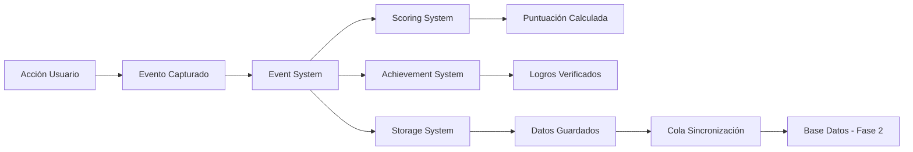

# Plan de Gamificación para Apps 2-5

## Resumen Ejecutivo

Este documento describe el plan completo de gamificación para las aplicaciones de entrenamiento rítmico (Apps 2-5) del repositorio Lab. El sistema está diseñado en dos fases: la Fase 1 implementa la mecánica de juego modular sin UI, mientras que la Fase 2 añadirá base de datos y elementos visuales.

## Objetivo

Aumentar el engagement y la motivación del usuario mediante un sistema de gamificación que:
- Registre y recompense el progreso del usuario
- Proporcione feedback inmediato sobre el rendimiento
- Fomente la práctica regular y la exploración de características
- Prepare los datos para análisis y mejoras futuras

## Arquitectura del Sistema

### Componentes Principales

```
/libs/gamification/
├── event-system.js     # Registro y gestión de eventos
├── scoring-system.js   # Cálculo de puntuaciones y niveles
├── achievements.js     # Sistema de logros y estadísticas
├── storage.js         # Almacenamiento local y sincronización
├── config.js          # Configuración centralizada
└── index.js          # API unificada y manager principal
```

### Flujo de Datos



## FASE 1: Mecánica de Juego Modular (Actual)

### 1. Sistema de Eventos

#### Tipos de Eventos Definidos

| Categoría | Evento | Descripción | Puntos Base |
|-----------|--------|-------------|-------------|
| **Práctica** | PRACTICE_STARTED | Iniciar sesión de práctica | 5 |
| | PRACTICE_COMPLETED | Completar práctica | 20 |
| | PATTERN_PLAYED | Reproducir patrón | 3 |
| **Precisión** | TAP_TEMPO_ACCURATE | Tap tempo preciso | 10 |
| | RHYTHM_MATCHED | Ritmo coincidente | 15 |
| | PERFECT_TIMING | Timing perfecto | 25 |
| **Exploración** | PARAMETER_CHANGED | Cambiar parámetro | 1 |
| | RANDOMIZATION_USED | Usar aleatorización | 3 |
| | FRACTION_CREATED | Crear fracción | 5 |
| **Creatividad** | PULSE_PATTERN_CREATED | Crear patrón | 8 |
| | LOOP_ACTIVATED | Activar loop | 3 |
| **Maestría** | COMPLEXITY_INCREASED | Aumentar complejidad | 10 |
| | PATTERN_MASTERED | Dominar patrón | 40 |

#### Estructura de Evento

```javascript
{
  evento_id: "evt_1234567890_abc123",
  evento_tipo: "PRACTICE_COMPLETED",
  timestamp: 1736620800000,
  session_id: 1736618400000,
  app_id: "app2",
  puntuacion_base: 20,
  metadata: {
    lg_value: 16,
    v_value: 120,
    duration_seconds: 180,
    accuracy_percentage: 85,
    session_duration: 300,
    time_since_last_event: 5
  }
}
```

### 2. Sistema de Puntuación

#### Multiplicadores

| Tipo | Condición | Multiplicador |
|------|-----------|---------------|
| **Racha** | 5 aciertos | 1.2x |
| | 10 aciertos | 1.5x |
| | 20 aciertos | 2.0x |
| | 50 aciertos | 3.0x |
| **Tiempo** | 5 minutos | 1.1x |
| | 10 minutos | 1.3x |
| | 20 minutos | 1.5x |
| | 30 minutos | 2.0x |
| **Complejidad** | Lg < 10 | 1.0x |
| | Lg 10-30 | 1.2x |
| | Lg 30-50 | 1.5x |
| | Lg > 50 | 2.0x |
| **Precisión** | 75-89% | 1.2x |
| | 90-99% | 1.5x |
| | 100% | 2.0x |

#### Niveles de Usuario

| Nivel | Puntos Requeridos | Título |
|-------|-------------------|--------|
| 1 | 0 | Principiante |
| 2 | 100 | Aprendiz |
| 3 | 300 | Estudiante |
| 4 | 600 | Practicante |
| 5 | 1,000 | Competente |
| 6 | 1,500 | Avanzado |
| 7 | 2,500 | Experto |
| 8 | 4,000 | Maestro |
| 9 | 6,000 | Virtuoso |
| 10 | 10,000 | Gran Maestro |

### 3. Sistema de Logros

#### Categorías de Logros

**Iniciación (2 logros)**
- 👶 Primeros Pasos - Completa tu primera práctica
- 🔍 Explorador - Cambia 10 parámetros diferentes

**Práctica Rítmica (3 logros)**
- 🥁 Novato Rítmico - 10 patrones correctos
- 🎵 Aprendiz Rítmico - 50 patrones correctos
- 🎼 Maestro del Ritmo - 200 patrones correctos

**Precisión (2 logros)**
- ⏱️ Timing Perfecto - 100% precisión en 5 patrones
- 👆 Maestro del Tap - 10 tap tempos precisos

**Tiempo (3 logros)**
- ⏰ Dedicado - 5 minutos continuos
- ⏳ Perseverante - 15 minutos continuos
- 🏃 Maratonista - 30 minutos continuos

**Creatividad (3 logros)**
- 🎨 Creador de Patrones - 20 patrones diferentes
- ➗ Explorador de Fracciones - 30 fracciones diferentes
- 🎲 Aleatorizador - 50 usos de aleatorización

**Complejidad (4 logros)**
- 1️⃣ Iniciando - Domina Lg < 10
- 2️⃣ Progresando - Domina Lg 10-30
- 3️⃣ Avanzado - Domina Lg 30-50
- 🏆 Experto - Domina Lg > 50

**Constancia (3 logros)**
- 📅 Práctica Diaria - 7 días consecutivos
- 🗓️ Guerrero Semanal - 14 días consecutivos
- 📆 Maestro Mensual - 30 días consecutivos

### 4. Integración con Apps

#### App2 - Sucesión de Pulsos

**Eventos a trackear:**
- Play/Stop → PRACTICE_STARTED/COMPLETED
- Tap Tempo → TAP_TEMPO_USED/ACCURATE
- Cambio Lg/V → PARAMETER_CHANGED
- Selección pulsos → PULSE_PATTERN_CREATED
- Activar loop → LOOP_ACTIVATED

#### App3 - Fracciones Temporales

**Eventos a trackear:**
- Crear fracción → FRACTION_CREATED
- Cambiar n/d → PARAMETER_CHANGED
- Aumentar complejidad → COMPLEXITY_INCREASED

#### App4 - Pulsos Fraccionados

**Eventos a trackear:**
- Fracción compleja → FRACTION_CREATED
- Activar subdivisión → ADVANCED_FEATURE_USED
- Patrón único → PULSE_PATTERN_CREATED

#### App5 - Pulsaciones

**Eventos a trackear:**
- Crear intervalo → PATTERN_PLAYED
- Modificar patrón → PULSE_PATTERN_CREATED
- Cambiar modo → PARAMETER_CHANGED

## Implementación Técnica

### Inicialización

```javascript
// En main.js de cada app
import { initGamification } from '../../libs/gamification/index.js';

// Después de DOMContentLoaded
initGamification('app2'); // o app3, app4, app5
```

### Tracking de Eventos

```javascript
import { trackEvent, EVENT_TYPES } from '../../libs/gamification/index.js';

// Ejemplo: cuando el usuario completa una práctica
trackEvent(EVENT_TYPES.PRACTICE_COMPLETED, {
  lg_value: 16,
  duration_seconds: 180,
  accuracy_percentage: 92
});
```

### Consulta de Estadísticas

```javascript
import { getGamificationManager } from '../../libs/gamification/index.js';

const manager = getGamificationManager();

// Obtener nivel del usuario
const level = manager.getUserLevel();
console.log(`Nivel ${level.level}: ${level.title}`);
console.log(`Progreso: ${level.progress_percentage}%`);

// Obtener logros
const achievements = manager.getAchievements();
const unlocked = achievements.filter(a => a.unlocked);
console.log(`Logros: ${unlocked.length}/${achievements.length}`);

// Obtener estadísticas de sesión
const stats = manager.getStats();
console.log(`Puntos sesión: ${stats.scoring.session_score}`);
console.log(`Racha actual: ${stats.scoring.current_streak}`);
```

### Configuración

```javascript
// Deshabilitar gamificación para una app
GAMIFICATION_CONFIG.apps.app2.enabled = false;

// Cambiar multiplicador de puntos
GAMIFICATION_CONFIG.scoring.pointsMultiplier = 1.5;

// Activar modo debug
GAMIFICATION_CONFIG.debugMode = true;
```

## FASE 2: Base de Datos y UI (Futura)

### Componentes a Implementar

#### Backend
- **API REST/GraphQL** para sincronización
- **Base de datos** PostgreSQL o MongoDB
- **Sistema de autenticación** OAuth2/JWT
- **WebSockets** para actualizaciones en tiempo real

#### Frontend UI
- **Dashboard de progreso** con gráficas
- **Sistema de notificaciones** para logros
- **Tabla de clasificación** global y por amigos
- **Perfil de usuario** con estadísticas detalladas
- **Badges visuales** para logros

#### Características Avanzadas
- **Desafíos diarios/semanales** con recompensas especiales
- **Sistema de temporadas** con reset periódico
- **Modo competitivo** con torneos
- **Integración social** compartir logros
- **Sistema de recompensas** desbloquear contenido
- **Analytics avanzado** para mejora continua

### Migración de Datos

Los eventos almacenados localmente en Fase 1 se migrarán automáticamente a la base de datos cuando esté disponible:

```javascript
// Proceso de migración automático
const localData = storage.exportForSync();
await api.syncEvents(localData);
storage.markAsSynced(localData.events);
```

## Testing y Validación

### Tests Unitarios Recomendados

```javascript
// Test de eventos
describe('EventSystem', () => {
  test('should generate unique event IDs', () => {
    const event1 = eventSystem.trackEvent('PRACTICE_STARTED');
    const event2 = eventSystem.trackEvent('PRACTICE_STARTED');
    expect(event1.evento_id).not.toBe(event2.evento_id);
  });
});

// Test de puntuación
describe('ScoringSystem', () => {
  test('should apply streak multiplier', () => {
    scoringSystem.currentStreak = 10;
    const score = scoringSystem.calculateScore('PATTERN_PLAYED');
    expect(score).toBeGreaterThan(baseScore);
  });
});
```

### Métricas de Rendimiento

- **Impacto en memoria**: < 1MB
- **Tiempo de inicialización**: < 100ms
- **Overhead por evento**: < 5ms
- **Tamaño de almacenamiento**: < 5MB

## Consideraciones de Privacidad

- Todos los datos se almacenan localmente en Fase 1
- No se comparte información sin consentimiento
- El usuario puede exportar/eliminar sus datos
- Cumplimiento con GDPR en Fase 2

## Roadmap

### Q1 2025 - Fase 1 Completada ✅
- [x] Sistema de eventos modular
- [x] Sistema de puntuación
- [x] Sistema de logros
- [x] Almacenamiento local
- [ ] Integración con apps
- [ ] Testing completo

### Q2 2025 - Fase 2 Inicio
- [ ] Diseño de base de datos
- [ ] Desarrollo de API
- [ ] Sistema de autenticación
- [ ] UI básica de progreso

### Q3 2025 - Fase 2 Desarrollo
- [ ] Dashboard completo
- [ ] Sistema de notificaciones
- [ ] Tabla de clasificación
- [ ] Integración social

### Q4 2025 - Fase 2 Finalización
- [ ] Características avanzadas
- [ ] Optimización y pulido
- [ ] Beta testing
- [ ] Lanzamiento

## Conclusión

El sistema de gamificación está diseñado para ser:
- **No invasivo**: Se integra sin afectar la funcionalidad existente
- **Escalable**: Preparado para crecimiento futuro
- **Configurable**: Adaptable a las necesidades de cada app
- **Resiliente**: Funciona offline y con recursos limitados
- **Motivador**: Fomenta el aprendizaje y la práctica regular

La implementación modular permite comenzar a recopilar datos inmediatamente mientras se desarrolla la UI y backend en paralelo, asegurando una transición suave entre fases.

---

*Documento actualizado: 2025-10-12*
*Versión: 1.0.0*