# Plan de Gamificación para Apps 2-5

## Resumen Ejecutivo

Este documento describe el plan completo de gamificación para las aplicaciones de entrenamiento rítmico (Apps 2-5) del repositorio Lab. El sistema está diseñado en dos fases: la Fase 1 implementa la mecánica de juego modular sin UI, mientras que la Fase 2 añadirá base de datos y elementos visuales.

## Objetivo

Aumentar el engagement y la motivación del usuario mediante un sistema de gamificación que:
- Registre y recompense el progreso del usuario
- Proporcione feedback inmediato sobre el rendimiento
- Fomente la práctica regular y la exploración de características
- Prepare los datos para análisis y mejoras futuras

## Arquitectura del Sistema

### Componentes Principales

```
/libs/gamification/
├── event-system.js     # Registro y gestión de eventos
├── scoring-system.js   # Cálculo de puntuaciones y niveles
├── achievements.js     # Sistema de logros y estadísticas
├── storage.js         # Almacenamiento local y sincronización
├── config.js          # Configuración centralizada
└── index.js          # API unificada y manager principal
```

### Flujo de Datos

```mermaid
graph LR
    A[Acción Usuario] --> B[Evento Capturado]
    B --> C[Event System]
    C --> D[Scoring System]
    C --> E[Achievement System]
    C --> F[Storage System]
    D --> G[Puntuación Calculada]
    E --> H[Logros Verificados]
    F --> I[Datos Guardados]
    I --> J[Cola Sincronización]
    J --> K[Base Datos - Fase 2]
```



## FASE 1: Mecánica de Juego Modular (Actual)

### 1. Sistema de Eventos

#### Tipos de Eventos Definidos

| Categoría | Evento | Descripción | Puntos Base |
|-----------|--------|-------------|-------------|
| **Práctica** | PRACTICE_STARTED | Iniciar sesión de práctica | 5 |
| | PRACTICE_COMPLETED | Completar práctica | 20 |
| | PATTERN_PLAYED | Reproducir patrón | 3 |
| **Precisión** | TAP_TEMPO_ACCURATE | Tap tempo preciso | 10 |
| | RHYTHM_MATCHED | Ritmo coincidente | 15 |
| | PERFECT_TIMING | Timing perfecto | 25 |
| **Exploración** | PARAMETER_CHANGED | Cambiar parámetro | 1 |
| | RANDOMIZATION_USED | Usar aleatorización | 3 |
| | FRACTION_CREATED | Crear fracción | 5 |
| **Creatividad** | PULSE_PATTERN_CREATED | Crear patrón | 8 |
| | LOOP_ACTIVATED | Activar loop | 3 |
| **Maestría** | COMPLEXITY_INCREASED | Aumentar complejidad | 10 |
| | PATTERN_MASTERED | Dominar patrón | 40 |

#### Estructura de Evento

```javascript
{
  evento_id: "evt_1234567890_abc123",
  evento_tipo: "PRACTICE_COMPLETED",
  timestamp: 1736620800000,
  session_id: 1736618400000,
  app_id: "app2",
  puntuacion_base: 20,
  metadata: {
    lg_value: 16,
    v_value: 120,
    duration_seconds: 180,
    accuracy_percentage: 85,
    session_duration: 300,
    time_since_last_event: 5
  }
}
```

### 2. Sistema de Puntuación

#### Multiplicadores

| Tipo | Condición | Multiplicador |
|------|-----------|---------------|
| **Racha** | 5 aciertos | 1.2x |
| | 10 aciertos | 1.5x |
| | 20 aciertos | 2.0x |
| | 50 aciertos | 3.0x |
| **Tiempo** | 5 minutos | 1.1x |
| | 10 minutos | 1.3x |
| | 20 minutos | 1.5x |
| | 30 minutos | 2.0x |
| **Complejidad** | Lg < 10 | 1.0x |
| | Lg 10-30 | 1.2x |
| | Lg 30-50 | 1.5x |
| | Lg > 50 | 2.0x |
| **Precisión** | 75-89% | 1.2x |
| | 90-99% | 1.5x |
| | 100% | 2.0x |

#### Niveles de Usuario

| Nivel | Puntos Requeridos | Título |
|-------|-------------------|--------|
| 1 | 0 | Principiante |
| 2 | 100 | Aprendiz |
| 3 | 300 | Estudiante |
| 4 | 600 | Practicante |
| 5 | 1,000 | Competente |
| 6 | 1,500 | Avanzado |
| 7 | 2,500 | Experto |
| 8 | 4,000 | Maestro |
| 9 | 6,000 | Virtuoso |
| 10 | 10,000 | Gran Maestro |

### 3. Sistema de Logros

#### Categorías de Logros

**Iniciación (2 logros)**
- 👶 Primeros Pasos - Completa tu primera práctica
- 🔍 Explorador - Cambia 10 parámetros diferentes

**Práctica Rítmica (3 logros)**
- 🥁 Novato Rítmico - 10 patrones correctos
- 🎵 Aprendiz Rítmico - 50 patrones correctos
- 🎼 Maestro del Ritmo - 200 patrones correctos

**Precisión (2 logros)**
- ⏱️ Timing Perfecto - 100% precisión en 5 patrones
- 👆 Maestro del Tap - 10 tap tempos precisos

**Tiempo (3 logros)**
- ⏰ Dedicado - 5 minutos continuos
- ⏳ Perseverante - 15 minutos continuos
- 🏃 Maratonista - 30 minutos continuos

**Creatividad (3 logros)**
- 🎨 Creador de Patrones - 20 patrones diferentes
- ➗ Explorador de Fracciones - 30 fracciones diferentes
- 🎲 Aleatorizador - 50 usos de aleatorización

**Complejidad (4 logros)**
- 1️⃣ Iniciando - Domina Lg < 10
- 2️⃣ Progresando - Domina Lg 10-30
- 3️⃣ Avanzado - Domina Lg 30-50
- 🏆 Experto - Domina Lg > 50

**Constancia (3 logros)**
- 📅 Práctica Diaria - 7 días consecutivos
- 🗓️ Guerrero Semanal - 14 días consecutivos
- 📆 Maestro Mensual - 30 días consecutivos

### 4. Integración con Apps

#### App2 - Sucesión de Pulsos

**Eventos a trackear:**
- Play/Stop → PRACTICE_STARTED/COMPLETED
- Tap Tempo → TAP_TEMPO_USED/ACCURATE
- Cambio Lg/V → PARAMETER_CHANGED
- Selección pulsos → PULSE_PATTERN_CREATED
- Activar loop → LOOP_ACTIVATED

#### App3 - Fracciones Temporales

**Eventos a trackear:**
- Crear fracción → FRACTION_CREATED
- Cambiar n/d → PARAMETER_CHANGED
- Aumentar complejidad → COMPLEXITY_INCREASED

#### App4 - Pulsos Fraccionados

**Eventos a trackear:**
- Fracción compleja → FRACTION_CREATED
- Activar subdivisión → ADVANCED_FEATURE_USED
- Patrón único → PULSE_PATTERN_CREATED

#### App5 - Pulsaciones

**Eventos a trackear:**
- Crear intervalo → PATTERN_PLAYED
- Modificar patrón → PULSE_PATTERN_CREATED
- Cambiar modo → PARAMETER_CHANGED

## Implementación Técnica

### Inicialización

```javascript
// En main.js de cada app
import { initGamification } from '../../libs/gamification/index.js';

// Después de DOMContentLoaded
initGamification('app2'); // o app3, app4, app5
```

### Tracking de Eventos

```javascript
import { trackEvent, EVENT_TYPES } from '../../libs/gamification/index.js';

// Ejemplo: cuando el usuario completa una práctica
trackEvent(EVENT_TYPES.PRACTICE_COMPLETED, {
  lg_value: 16,
  duration_seconds: 180,
  accuracy_percentage: 92
});
```

### Consulta de Estadísticas

```javascript
import { getGamificationManager } from '../../libs/gamification/index.js';

const manager = getGamificationManager();

// Obtener nivel del usuario
const level = manager.getUserLevel();
console.log(`Nivel ${level.level}: ${level.title}`);
console.log(`Progreso: ${level.progress_percentage}%`);

// Obtener logros
const achievements = manager.getAchievements();
const unlocked = achievements.filter(a => a.unlocked);
console.log(`Logros: ${unlocked.length}/${achievements.length}`);

// Obtener estadísticas de sesión
const stats = manager.getStats();
console.log(`Puntos sesión: ${stats.scoring.session_score}`);
console.log(`Racha actual: ${stats.scoring.current_streak}`);
```

### Configuración

```javascript
// Deshabilitar gamificación para una app
GAMIFICATION_CONFIG.apps.app2.enabled = false;

// Cambiar multiplicador de puntos
GAMIFICATION_CONFIG.scoring.pointsMultiplier = 1.5;

// Activar modo debug
GAMIFICATION_CONFIG.debugMode = true;
```

## FASE 2: Backend, Ejercicios y Captura de Audio

**Nota importante:** Esta fase NO incluye sistema de autenticación ni características avanzadas (reservadas para Fase 4). Se enfoca en:
- Backend simple con 2 usuarios de prueba
- Sistema de ejercicios con captura de audio
- Sincronización con base de datos
- UI básica para ejercicios

### Fase 2a: Backend y Base de Datos

#### Estructura de Base de Datos (SQLite)

```sql
-- Tabla de usuarios (simple, sin autenticación)
CREATE TABLE users (
  user_id INTEGER PRIMARY KEY AUTOINCREMENT,
  username TEXT UNIQUE NOT NULL,  -- 'tester' o 'user'
  display_name TEXT,
  created_at INTEGER NOT NULL,
  total_score INTEGER DEFAULT 0,
  current_level INTEGER DEFAULT 1
);

-- Tabla de ejercicios
CREATE TABLE exercises (
  exercise_id INTEGER PRIMARY KEY AUTOINCREMENT,
  exercise_type TEXT NOT NULL,  -- 'sequence_entry', 'rhythm_sync', 'tap_matching', 'fraction_recognition'
  title TEXT NOT NULL,
  description TEXT,
  difficulty_level INTEGER,  -- 1-5
  parameters TEXT,  -- JSON con configuración específica
  created_at INTEGER NOT NULL
);

-- Tabla de intentos de ejercicio
CREATE TABLE user_exercises (
  attempt_id INTEGER PRIMARY KEY AUTOINCREMENT,
  user_id INTEGER NOT NULL,
  exercise_id INTEGER NOT NULL,
  started_at INTEGER NOT NULL,
  completed_at INTEGER,
  score INTEGER,
  accuracy_percentage REAL,
  attempt_data TEXT,  -- JSON con datos del intento
  FOREIGN KEY (user_id) REFERENCES users(user_id),
  FOREIGN KEY (exercise_id) REFERENCES exercises(exercise_id)
);

-- Tabla de sesiones (migrada de localStorage)
CREATE TABLE sessions (
  session_id INTEGER PRIMARY KEY,
  user_id INTEGER NOT NULL,
  app_id TEXT NOT NULL,
  started_at INTEGER NOT NULL,
  ended_at INTEGER,
  total_events INTEGER DEFAULT 0,
  total_score INTEGER DEFAULT 0,
  FOREIGN KEY (user_id) REFERENCES users(user_id)
);

-- Tabla de eventos (migrada de localStorage)
CREATE TABLE events (
  event_id TEXT PRIMARY KEY,
  user_id INTEGER NOT NULL,
  session_id INTEGER NOT NULL,
  event_type TEXT NOT NULL,
  timestamp INTEGER NOT NULL,
  app_id TEXT NOT NULL,
  base_score INTEGER,
  final_score INTEGER,
  metadata TEXT,  -- JSON
  synced INTEGER DEFAULT 1,
  FOREIGN KEY (user_id) REFERENCES users(user_id),
  FOREIGN KEY (session_id) REFERENCES sessions(session_id)
);
```

#### API REST con Express.js

```javascript
// /server/api/routes.js
const express = require('express');
const router = express.Router();

// === USUARIOS ===
// GET /api/users - Listar usuarios
router.get('/users', async (req, res) => {
  // Devuelve: [{ user_id, username, display_name, total_score, current_level }]
});

// GET /api/users/:id - Obtener usuario específico
router.get('/users/:id', async (req, res) => {
  // Devuelve: { user_id, username, stats, recent_activity }
});

// === EJERCICIOS ===
// GET /api/exercises - Listar ejercicios disponibles
router.get('/exercises', async (req, res) => {
  // Query params: ?type=sequence_entry&difficulty=1-3
  // Devuelve: [{ exercise_id, type, title, difficulty, parameters }]
});

// POST /api/exercises/:id/start - Iniciar ejercicio
router.post('/exercises/:id/start', async (req, res) => {
  // Body: { user_id }
  // Devuelve: { attempt_id, exercise_data }
});

// POST /api/exercises/:id/complete - Completar ejercicio
router.post('/exercises/:id/complete', async (req, res) => {
  // Body: { attempt_id, score, accuracy, attempt_data }
  // Devuelve: { saved: true, new_score, achievements_unlocked }
});

// === SESIONES ===
// POST /api/sessions/start - Iniciar sesión
router.post('/sessions/start', async (req, res) => {
  // Body: { user_id, app_id }
  // Devuelve: { session_id }
});

// POST /api/sessions/:id/end - Finalizar sesión
router.post('/sessions/:id/end', async (req, res) => {
  // Body: { total_events, total_score }
});

// === EVENTOS ===
// POST /api/events/sync - Sincronizar eventos desde localStorage
router.post('/events/sync', async (req, res) => {
  // Body: { user_id, events: [...] }
  // Devuelve: { synced_count, failed_count }
});

// GET /api/events/history - Historial de eventos
router.get('/events/history', async (req, res) => {
  // Query params: ?user_id=1&app_id=app2&limit=100
});

module.exports = router;
```

#### Sistema de Usuario Simple (Sin Autenticación)

```javascript
// /libs/gamification/user-manager.js
class UserManager {
  constructor() {
    this.currentUser = null;
    this.loadCurrentUser();
  }

  // Cargar usuario actual desde localStorage
  loadCurrentUser() {
    const stored = localStorage.getItem('current_user_id');
    this.currentUser = stored ? parseInt(stored) : 1; // Default: user 1
  }

  // Cambiar usuario (desde consola)
  switchUser(userId) {
    if (userId !== 1 && userId !== 2) {
      console.error('Solo existen user_id 1 (tester) y 2 (user)');
      return false;
    }
    this.currentUser = userId;
    localStorage.setItem('current_user_id', userId);
    console.log(`Usuario cambiado a: ${userId === 1 ? 'tester' : 'user'}`);
    return true;
  }

  getCurrentUserId() {
    return this.currentUser;
  }
}

// Exponer globalmente para uso en consola
window.__USER_MANAGER = new UserManager();
```

**Uso en consola:**
```javascript
// Cambiar a usuario 'tester' (user_id: 1)
window.__USER_MANAGER.switchUser(1);

// Cambiar a usuario 'user' (user_id: 2)
window.__USER_MANAGER.switchUser(2);

// Ver usuario actual
window.__USER_MANAGER.getCurrentUserId();
```

### Fase 2b: Sistema de Captura de Audio

#### Módulo de Captura de Micrófono

```javascript
// /libs/audio-capture/microphone.js
import Tone from '../../vendor/Tone.js';

export class MicrophoneCapture {
  constructor() {
    this.mic = null;
    this.meter = null;
    this.isRecording = false;
    this.beats = [];
  }

  async initialize() {
    // Solicitar permiso de micrófono
    this.mic = new Tone.UserMedia();
    await this.mic.open();

    // Crear analizador para detección de beats
    this.meter = new Tone.Meter();
    this.mic.connect(this.meter);

    console.log('Micrófono inicializado');
  }

  startRecording() {
    this.isRecording = true;
    this.beats = [];
    this.recordingStartTime = Tone.now();

    // Polling para detectar picos de audio
    this.detectionInterval = setInterval(() => {
      if (this.meter.getValue() > -30) { // Umbral ajustable
        const timestamp = Tone.now() - this.recordingStartTime;
        this.beats.push(timestamp);
      }
    }, 10); // Check cada 10ms
  }

  stopRecording() {
    this.isRecording = false;
    clearInterval(this.detectionInterval);
    return this.beats;
  }

  dispose() {
    if (this.mic) this.mic.close();
    if (this.detectionInterval) clearInterval(this.detectionInterval);
  }
}
```

#### Módulo de Captura de Teclado

```javascript
// /libs/audio-capture/keyboard.js
export class KeyboardCapture {
  constructor(targetKey = ' ') { // Space por defecto
    this.targetKey = targetKey;
    this.taps = [];
    this.isRecording = false;
    this.recordingStartTime = null;
  }

  startRecording() {
    this.isRecording = true;
    this.taps = [];
    this.recordingStartTime = performance.now();

    this.handleKeyDown = (e) => {
      if (e.key === this.targetKey && this.isRecording) {
        e.preventDefault();
        const timestamp = (performance.now() - this.recordingStartTime) / 1000;
        this.taps.push(timestamp);
      }
    };

    document.addEventListener('keydown', this.handleKeyDown);
  }

  stopRecording() {
    this.isRecording = false;
    document.removeEventListener('keydown', this.handleKeyDown);
    return this.taps;
  }
}
```

#### Módulo de Análisis de Ritmo

```javascript
// /libs/audio-capture/rhythm-analysis.js
export class RhythmAnalyzer {
  constructor() {
    this.tolerance = 0.1; // 10% de tolerancia
  }

  // Comparar ritmo grabado con patrón esperado
  compareRhythm(recorded, expected) {
    if (recorded.length !== expected.length) {
      return {
        matched: false,
        accuracy: 0,
        errors: recorded.length > expected.length ? 'too_many_beats' : 'too_few_beats'
      };
    }

    let totalError = 0;
    const deviations = [];

    for (let i = 0; i < recorded.length; i++) {
      const deviation = Math.abs(recorded[i] - expected[i]);
      deviations.push(deviation);
      totalError += deviation;
    }

    const avgDeviation = totalError / recorded.length;
    const maxAllowedDeviation = this.tolerance * (expected[expected.length - 1] / expected.length);
    const accuracy = Math.max(0, 100 - (avgDeviation / maxAllowedDeviation * 100));

    return {
      matched: accuracy >= 75, // 75% mínimo para considerar correcto
      accuracy: Math.round(accuracy),
      deviations,
      avgDeviation
    };
  }

  // Detectar tempo (BPM) desde taps
  detectTempo(taps) {
    if (taps.length < 2) return null;

    const intervals = [];
    for (let i = 1; i < taps.length; i++) {
      intervals.push(taps[i] - taps[i-1]);
    }

    const avgInterval = intervals.reduce((a, b) => a + b) / intervals.length;
    const bpm = Math.round(60 / avgInterval);

    return {
      bpm,
      avgInterval,
      consistency: this.calculateConsistency(intervals)
    };
  }

  calculateConsistency(intervals) {
    const avg = intervals.reduce((a, b) => a + b) / intervals.length;
    const variance = intervals.reduce((sum, val) => sum + Math.pow(val - avg, 2), 0) / intervals.length;
    const stdDev = Math.sqrt(variance);
    const consistency = Math.max(0, 100 - (stdDev / avg * 100));
    return Math.round(consistency);
  }
}
```

### Fase 2c: Sistema de Ejercicios

#### Clase Base de Ejercicio

```javascript
// /libs/exercises/base-exercise.js
export class BaseExercise {
  constructor(exerciseId, config) {
    this.exerciseId = exerciseId;
    this.config = config;
    this.attemptId = null;
    this.startTime = null;
    this.userData = {};
  }

  async start(userId) {
    // Registrar inicio en BD
    const response = await fetch(`/api/exercises/${this.exerciseId}/start`, {
      method: 'POST',
      headers: { 'Content-Type': 'application/json' },
      body: JSON.stringify({ user_id: userId })
    });
    const data = await response.json();
    this.attemptId = data.attempt_id;
    this.startTime = Date.now();

    // Hook para inicialización específica
    await this.onStart();
  }

  async complete(score, accuracy, attemptData) {
    const response = await fetch(`/api/exercises/${this.exerciseId}/complete`, {
      method: 'POST',
      headers: { 'Content-Type': 'application/json' },
      body: JSON.stringify({
        attempt_id: this.attemptId,
        score,
        accuracy,
        attempt_data: attemptData
      })
    });

    const result = await response.json();
    await this.onComplete(result);
    return result;
  }

  // Hooks para override
  async onStart() {}
  async onComplete(result) {}
  async onError(error) {}
}
```

#### Ejercicio 1: Entrada de Secuencia (Patrones Par-Impar)

```javascript
// /libs/exercises/sequence-entry.js
import { BaseExercise } from './base-exercise.js';

export class SequenceEntryExercise extends BaseExercise {
  constructor(exerciseId, config) {
    super(exerciseId, config);
    this.targetPattern = config.pattern; // ej: [0,1,0,1,0,1,0,1] (par-impar)
    this.userInput = [];
  }

  async onStart() {
    // Renderizar UI de entrada
    this.renderUI();
  }

  renderUI() {
    const container = document.getElementById('exercise-container');
    container.innerHTML = `
      <div class="sequence-exercise">
        <h2>Ingresa el patrón par-impar</h2>
        <p>Longitud del patrón: ${this.config.length}</p>
        <p>Ejemplo: Par = 0, Impar = 1</p>
        <div class="pattern-input">
          ${Array(this.config.length).fill(0).map((_, i) => `
            <button class="pattern-btn" data-index="${i}">?</button>
          `).join('')}
        </div>
        <div class="pattern-controls">
          <button id="toggle-btn">Par/Impar</button>
          <button id="submit-btn">Enviar</button>
        </div>
      </div>
    `;

    // Event listeners
    document.querySelectorAll('.pattern-btn').forEach(btn => {
      btn.addEventListener('click', (e) => {
        const index = parseInt(e.target.dataset.index);
        this.togglePosition(index);
      });
    });

    document.getElementById('submit-btn').addEventListener('click', () => {
      this.submitPattern();
    });
  }

  togglePosition(index) {
    if (this.userInput[index] === undefined) {
      this.userInput[index] = 0; // Par
    } else {
      this.userInput[index] = 1 - this.userInput[index]; // Toggle
    }
    this.updateUI();
  }

  updateUI() {
    document.querySelectorAll('.pattern-btn').forEach((btn, i) => {
      const val = this.userInput[i];
      btn.textContent = val === undefined ? '?' : (val === 0 ? 'Par' : 'Impar');
      btn.classList.toggle('even', val === 0);
      btn.classList.toggle('odd', val === 1);
    });
  }

  async submitPattern() {
    // Validar que se ingresaron todos los valores
    if (this.userInput.length !== this.config.length || this.userInput.includes(undefined)) {
      alert('Completa todo el patrón');
      return;
    }

    // Calcular precisión
    let correct = 0;
    for (let i = 0; i < this.targetPattern.length; i++) {
      if (this.userInput[i] === this.targetPattern[i]) correct++;
    }
    const accuracy = (correct / this.targetPattern.length) * 100;
    const score = Math.round(accuracy * this.config.difficulty);

    // Guardar en BD
    await this.complete(score, accuracy, {
      target_pattern: this.targetPattern,
      user_pattern: this.userInput,
      correct_count: correct
    });

    // Mostrar resultado
    this.showResult(accuracy, correct);
  }

  showResult(accuracy, correct) {
    const container = document.getElementById('exercise-container');
    container.innerHTML = `
      <div class="exercise-result">
        <h2>${accuracy === 100 ? '¡Perfecto!' : accuracy >= 75 ? 'Bien hecho' : 'Intenta de nuevo'}</h2>
        <p>Aciertos: ${correct}/${this.targetPattern.length}</p>
        <p>Precisión: ${accuracy.toFixed(1)}%</p>
        <button id="retry-btn">Reintentar</button>
        <button id="next-btn">Siguiente</button>
      </div>
    `;
  }
}
```

#### Ejercicio 2: Sincronización Rítmica (Micrófono + Teclado)

```javascript
// /libs/exercises/rhythm-sync.js
import { BaseExercise } from './base-exercise.js';
import { MicrophoneCapture } from '../audio-capture/microphone.js';
import { KeyboardCapture } from '../audio-capture/keyboard.js';
import { RhythmAnalyzer } from '../audio-capture/rhythm-analysis.js';

export class RhythmSyncExercise extends BaseExercise {
  constructor(exerciseId, config) {
    super(exerciseId, config);
    this.targetRhythm = config.rhythm; // Array de timestamps esperados
    this.inputMode = config.input_mode || 'both'; // 'mic', 'keyboard', 'both'
    this.micCapture = null;
    this.keyCapture = null;
    this.analyzer = new RhythmAnalyzer();
  }

  async onStart() {
    // Inicializar captura según modo
    if (this.inputMode === 'mic' || this.inputMode === 'both') {
      this.micCapture = new MicrophoneCapture();
      await this.micCapture.initialize();
    }

    if (this.inputMode === 'keyboard' || this.inputMode === 'both') {
      this.keyCapture = new KeyboardCapture(' '); // Space key
    }

    this.renderUI();
    this.playTargetRhythm(); // Reproducir patrón objetivo
  }

  renderUI() {
    const container = document.getElementById('exercise-container');
    container.innerHTML = `
      <div class="rhythm-sync-exercise">
        <h2>Sincroniza el ritmo</h2>
        <p>Escucha el patrón y repítelo usando ${this.getInputModeText()}</p>
        <div class="rhythm-display">
          <canvas id="rhythm-canvas" width="600" height="200"></canvas>
        </div>
        <div class="rhythm-controls">
          <button id="play-target-btn">Reproducir patrón</button>
          <button id="start-record-btn">Comenzar grabación</button>
          <button id="stop-record-btn" disabled>Detener grabación</button>
        </div>
        <div id="feedback"></div>
      </div>
    `;

    // Event listeners
    document.getElementById('play-target-btn').addEventListener('click', () => {
      this.playTargetRhythm();
    });

    document.getElementById('start-record-btn').addEventListener('click', () => {
      this.startRecording();
    });

    document.getElementById('stop-record-btn').addEventListener('click', () => {
      this.stopRecording();
    });
  }

  getInputModeText() {
    switch (this.inputMode) {
      case 'mic': return 'el micrófono';
      case 'keyboard': return 'la tecla Espacio';
      case 'both': return 'el micrófono O la tecla Espacio';
    }
  }

  async playTargetRhythm() {
    // Usar Tone.js para reproducir el patrón
    // (implementación similar a TimelineAudio)
    console.log('Reproduciendo patrón objetivo:', this.targetRhythm);
  }

  startRecording() {
    if (this.micCapture) this.micCapture.startRecording();
    if (this.keyCapture) this.keyCapture.startRecording();

    document.getElementById('start-record-btn').disabled = true;
    document.getElementById('stop-record-btn').disabled = false;
    document.getElementById('feedback').textContent = '🔴 Grabando...';
  }

  async stopRecording() {
    let recordedBeats = [];

    // Obtener beats del micrófono
    if (this.micCapture) {
      const micBeats = this.micCapture.stopRecording();
      recordedBeats = recordedBeats.concat(micBeats);
    }

    // Obtener taps del teclado
    if (this.keyCapture) {
      const keyTaps = this.keyCapture.stopRecording();
      recordedBeats = recordedBeats.concat(keyTaps);
    }

    // Ordenar y eliminar duplicados
    recordedBeats.sort((a, b) => a - b);
    recordedBeats = this.removeDuplicates(recordedBeats, 0.1); // 100ms threshold

    // Analizar precisión
    const result = this.analyzer.compareRhythm(recordedBeats, this.targetRhythm);

    // Guardar en BD
    await this.complete(
      Math.round(result.accuracy * this.config.difficulty),
      result.accuracy,
      {
        target_rhythm: this.targetRhythm,
        recorded_beats: recordedBeats,
        deviations: result.deviations,
        input_mode: this.inputMode
      }
    );

    // Mostrar resultado
    this.showResult(result);
  }

  removeDuplicates(beats, threshold) {
    const filtered = [];
    for (let i = 0; i < beats.length; i++) {
      if (i === 0 || beats[i] - beats[i-1] > threshold) {
        filtered.push(beats[i]);
      }
    }
    return filtered;
  }

  showResult(result) {
    const feedbackEl = document.getElementById('feedback');
    feedbackEl.innerHTML = `
      <h3>${result.matched ? '✅ ¡Excelente!' : '❌ Intenta de nuevo'}</h3>
      <p>Precisión: ${result.accuracy}%</p>
      <p>Desviación promedio: ${(result.avgDeviation * 1000).toFixed(0)}ms</p>
    `;

    document.getElementById('start-record-btn').disabled = false;
    document.getElementById('stop-record-btn').disabled = true;
  }
}
```

#### Ejercicio 3: Tap Matching (Independiente)

```javascript
// /libs/exercises/tap-matching.js
import { BaseExercise } from './base-exercise.js';
import { RhythmAnalyzer } from '../audio-capture/rhythm-analysis.js';

export class TapMatchingExercise extends BaseExercise {
  constructor(exerciseId, config) {
    super(exerciseId, config);
    this.targetBPM = config.bpm;
    this.targetTaps = config.tap_count || 8;
    this.userTaps = [];
    this.analyzer = new RhythmAnalyzer();
  }

  async onStart() {
    this.renderUI();
  }

  renderUI() {
    const container = document.getElementById('exercise-container');
    container.innerHTML = `
      <div class="tap-matching-exercise">
        <h2>Tap Matching</h2>
        <p>Meta: ${this.targetBPM} BPM</p>
        <p>Taps requeridos: ${this.targetTaps}</p>
        <div class="tap-area">
          <button id="tap-btn" class="tap-button">TAP</button>
        </div>
        <div id="tap-feedback">
          <p>Taps: <span id="tap-count">0</span>/${this.targetTaps}</p>
          <p>BPM actual: <span id="current-bpm">--</span></p>
        </div>
      </div>
    `;

    document.getElementById('tap-btn').addEventListener('click', () => {
      this.recordTap();
    });
  }

  recordTap() {
    const now = performance.now() / 1000;
    this.userTaps.push(now);

    document.getElementById('tap-count').textContent = this.userTaps.length;

    if (this.userTaps.length >= 2) {
      const tempoData = this.analyzer.detectTempo(this.userTaps);
      document.getElementById('current-bpm').textContent = tempoData.bpm;
    }

    if (this.userTaps.length === this.targetTaps) {
      this.evaluateTaps();
    }
  }

  async evaluateTaps() {
    const tempoData = this.analyzer.detectTempo(this.userTaps);
    const bpmError = Math.abs(tempoData.bpm - this.targetBPM);
    const accuracy = Math.max(0, 100 - (bpmError / this.targetBPM * 100));

    await this.complete(
      Math.round(accuracy * this.config.difficulty),
      accuracy,
      {
        target_bpm: this.targetBPM,
        achieved_bpm: tempoData.bpm,
        consistency: tempoData.consistency,
        taps: this.userTaps
      }
    );

    this.showResult(accuracy, tempoData);
  }

  showResult(accuracy, tempoData) {
    const container = document.getElementById('exercise-container');
    container.innerHTML = `
      <div class="exercise-result">
        <h2>${accuracy >= 90 ? '🎯 ¡Perfecto!' : accuracy >= 75 ? '👍 Bien' : '💪 Sigue practicando'}</h2>
        <p>BPM objetivo: ${this.targetBPM}</p>
        <p>BPM logrado: ${tempoData.bpm}</p>
        <p>Consistencia: ${tempoData.consistency}%</p>
        <p>Precisión: ${accuracy.toFixed(1)}%</p>
      </div>
    `;
  }
}
```

#### Ejercicio 4: Reconocimiento de Fracciones (Independiente)

```javascript
// /libs/exercises/fraction-recognition.js
import { BaseExercise } from './base-exercise.js';

export class FractionRecognitionExercise extends BaseExercise {
  constructor(exerciseId, config) {
    super(exerciseId, config);
    this.targetFraction = config.fraction; // { n: 3, d: 4 }
    this.options = config.options || this.generateOptions();
  }

  generateOptions() {
    // Generar 4 opciones incluyendo la correcta
    const fractions = [
      this.targetFraction,
      { n: 2, d: 4 },
      { n: 4, d: 4 },
      { n: 3, d: 8 }
    ];
    return this.shuffle(fractions);
  }

  shuffle(array) {
    return array.sort(() => Math.random() - 0.5);
  }

  async onStart() {
    this.renderUI();
    this.playFraction();
  }

  renderUI() {
    const container = document.getElementById('exercise-container');
    container.innerHTML = `
      <div class="fraction-recognition-exercise">
        <h2>Reconoce la fracción temporal</h2>
        <p>Escucha el patrón y selecciona la fracción correcta</p>
        <button id="replay-btn">🔊 Reproducir de nuevo</button>
        <div class="fraction-options">
          ${this.options.map((f, i) => `
            <button class="fraction-option" data-index="${i}">
              ${f.n}/${f.d}
            </button>
          `).join('')}
        </div>
      </div>
    `;

    document.getElementById('replay-btn').addEventListener('click', () => {
      this.playFraction();
    });

    document.querySelectorAll('.fraction-option').forEach(btn => {
      btn.addEventListener('click', (e) => {
        const index = parseInt(e.target.dataset.index);
        this.selectOption(index);
      });
    });
  }

  async playFraction() {
    // Reproducir la fracción temporal usando Tone.js
    console.log('Reproduciendo fracción:', this.targetFraction);
  }

  async selectOption(index) {
    const selected = this.options[index];
    const isCorrect = selected.n === this.targetFraction.n &&
                      selected.d === this.targetFraction.d;

    const accuracy = isCorrect ? 100 : 0;
    const score = isCorrect ? (10 * this.config.difficulty) : 0;

    await this.complete(score, accuracy, {
      target_fraction: this.targetFraction,
      selected_fraction: selected,
      correct: isCorrect
    });

    this.showResult(isCorrect, selected);
  }

  showResult(isCorrect, selected) {
    const container = document.getElementById('exercise-container');
    container.innerHTML = `
      <div class="exercise-result">
        <h2>${isCorrect ? '✅ ¡Correcto!' : '❌ Incorrecto'}</h2>
        <p>Fracción correcta: ${this.targetFraction.n}/${this.targetFraction.d}</p>
        <p>Tu respuesta: ${selected.n}/${selected.d}</p>
        <button id="next-btn">Siguiente</button>
      </div>
    `;
  }
}
```

### Fase 2d: Integración y UI

#### Lanzador de Ejercicios

```javascript
// /libs/exercises/exercise-launcher.js
import { SequenceEntryExercise } from './sequence-entry.js';
import { RhythmSyncExercise } from './rhythm-sync.js';
import { TapMatchingExercise } from './tap-matching.js';
import { FractionRecognitionExercise } from './fraction-recognition.js';

export class ExerciseLauncher {
  constructor() {
    this.currentExercise = null;
    this.userId = window.__USER_MANAGER.getCurrentUserId();
  }

  async loadExercises() {
    const response = await fetch('/api/exercises');
    const exercises = await response.json();
    return exercises;
  }

  async startExercise(exerciseId, exerciseType, config) {
    let ExerciseClass;

    switch (exerciseType) {
      case 'sequence_entry':
        ExerciseClass = SequenceEntryExercise;
        break;
      case 'rhythm_sync':
        ExerciseClass = RhythmSyncExercise;
        break;
      case 'tap_matching':
        ExerciseClass = TapMatchingExercise;
        break;
      case 'fraction_recognition':
        ExerciseClass = FractionRecognitionExercise;
        break;
      default:
        throw new Error(`Tipo de ejercicio desconocido: ${exerciseType}`);
    }

    this.currentExercise = new ExerciseClass(exerciseId, config);
    await this.currentExercise.start(this.userId);
  }
}

// Exponer globalmente
window.__EXERCISE_LAUNCHER = new ExerciseLauncher();
```

#### UI de Selección de Ejercicios

```javascript
// /apps/exercises/index.html
<!DOCTYPE html>
<html lang="es">
<head>
  <meta charset="UTF-8">
  <title>Ejercicios de Entrenamiento Rítmico</title>
  <link rel="stylesheet" href="../../libs/shared-ui/index.css">
  <link rel="stylesheet" href="./styles/exercises.css">
</head>
<body>
  <h1>Ejercicios de Entrenamiento</h1>

  <div class="user-switcher">
    <label>Usuario:</label>
    <select id="user-select">
      <option value="1">Tester</option>
      <option value="2">User</option>
    </select>
  </div>

  <div id="exercise-list" class="exercise-grid">
    <!-- Se llenará dinámicamente -->
  </div>

  <div id="exercise-container" class="exercise-area" hidden>
    <!-- Aquí se renderizará cada ejercicio -->
  </div>

  <script type="module" src="./scripts/main.js"></script>
</body>
</html>
```

### Migración de Datos de Fase 1 a Fase 2

```javascript
// /libs/gamification/migration.js
export async function migrateLocalDataToDatabase() {
  const userId = window.__USER_MANAGER.getCurrentUserId();

  // Obtener datos locales
  const localEvents = JSON.parse(localStorage.getItem('gamification_events') || '[]');
  const localSessions = JSON.parse(localStorage.getItem('gamification_sessions') || '[]');

  if (localEvents.length === 0) {
    console.log('No hay datos locales para migrar');
    return;
  }

  // Sincronizar eventos
  const response = await fetch('/api/events/sync', {
    method: 'POST',
    headers: { 'Content-Type': 'application/json' },
    body: JSON.stringify({
      user_id: userId,
      events: localEvents,
      sessions: localSessions
    })
  });

  const result = await response.json();

  if (result.synced_count > 0) {
    // Limpiar datos locales ya sincronizados
    localStorage.removeItem('gamification_events');
    localStorage.removeItem('gamification_sessions');
    console.log(`✅ ${result.synced_count} eventos migrados correctamente`);
  }

  return result;
}

// Auto-migrar al detectar conexión con servidor
window.addEventListener('load', async () => {
  try {
    await fetch('/api/health'); // Health check
    await migrateLocalDataToDatabase();
  } catch (e) {
    console.log('Servidor no disponible, continuando en modo offline');
  }
});
```

## Testing y Validación

### Tests Unitarios Recomendados

```javascript
// Test de eventos
describe('EventSystem', () => {
  test('should generate unique event IDs', () => {
    const event1 = eventSystem.trackEvent('PRACTICE_STARTED');
    const event2 = eventSystem.trackEvent('PRACTICE_STARTED');
    expect(event1.evento_id).not.toBe(event2.evento_id);
  });
});

// Test de puntuación
describe('ScoringSystem', () => {
  test('should apply streak multiplier', () => {
    scoringSystem.currentStreak = 10;
    const score = scoringSystem.calculateScore('PATTERN_PLAYED');
    expect(score).toBeGreaterThan(baseScore);
  });
});
```

### Métricas de Rendimiento

- **Impacto en memoria**: < 1MB
- **Tiempo de inicialización**: < 100ms
- **Overhead por evento**: < 5ms
- **Tamaño de almacenamiento**: < 5MB

## Consideraciones de Privacidad

- Todos los datos se almacenan localmente en Fase 1
- No se comparte información sin consentimiento
- El usuario puede exportar/eliminar sus datos
- Cumplimiento con GDPR en Fase 2

## Roadmap

### Q1 2025 - Fase 1 ✅ COMPLETADA
- [x] Sistema de eventos modular
- [x] Sistema de puntuación con multiplicadores
- [x] Sistema de logros (20 achievements)
- [x] Almacenamiento local con cola de sincronización
- [x] Integración con Apps 2-5
- [x] Adaptadores específicos por aplicación
- [x] Documentación completa

### Q2 2025 - Fase 2a: Backend (PLANIFICADA)
- [ ] Diseño esquema SQLite
- [ ] Implementación API REST con Express.js
- [ ] Sistema de usuario simple (2 usuarios)
- [ ] Endpoints para ejercicios y eventos
- [ ] Migración de datos localStorage → BD

### Q2 2025 - Fase 2b: Audio Capture (PLANIFICADA)
- [ ] Módulo de captura de micrófono
- [ ] Módulo de captura de teclado (Space)
- [ ] Sistema de análisis rítmico
- [ ] Beat detection y comparación
- [ ] Detección de tempo (BPM)

### Q3 2025 - Fase 2c: Ejercicios (PLANIFICADA)
- [ ] Clase base de ejercicio
- [ ] Ejercicio 1: Entrada de secuencia (par-impar)
- [ ] Ejercicio 2: Sincronización rítmica (mic + teclado)
- [ ] Ejercicio 3: Tap Matching
- [ ] Ejercicio 4: Reconocimiento de fracciones
- [ ] Sistema de puntuación de ejercicios

### Q3 2025 - Fase 2d: Integración (PLANIFICADA)
- [ ] Lanzador de ejercicios
- [ ] UI de selección de ejercicios
- [ ] Feedback visual en tiempo real
- [ ] Resultados y estadísticas
- [ ] Testing completo Fase 2

### Q4 2025 - Fase 3: UI de Gamificación (FUTURA)
- [ ] Dashboard visual con gráficas
- [ ] Notificaciones de logros
- [ ] Visualización de progreso
- [ ] Perfil de usuario detallado
- [ ] Badges visuales

### 2026 - Fase 4: Características Avanzadas (FUTURA)
- [ ] Sistema de autenticación (OAuth2/JWT)
- [ ] Tabla de clasificación global
- [ ] Integración social
- [ ] Desafíos diarios/semanales
- [ ] Sistema de temporadas
- [ ] Modo competitivo
- [ ] Recompensas y contenido desbloqueable

## Conclusión

El sistema de gamificación está diseñado para ser:
- **No invasivo**: Se integra sin afectar la funcionalidad existente
- **Escalable**: Preparado para crecimiento futuro
- **Configurable**: Adaptable a las necesidades de cada app
- **Resiliente**: Funciona offline y con recursos limitados
- **Motivador**: Fomenta el aprendizaje y la práctica regular

La implementación modular permite comenzar a recopilar datos inmediatamente mientras se desarrolla la UI y backend en paralelo, asegurando una transición suave entre fases.

---

*Documento actualizado: 2025-10-13*
*Versión: 2.0.0 - Fase 2 planificada*